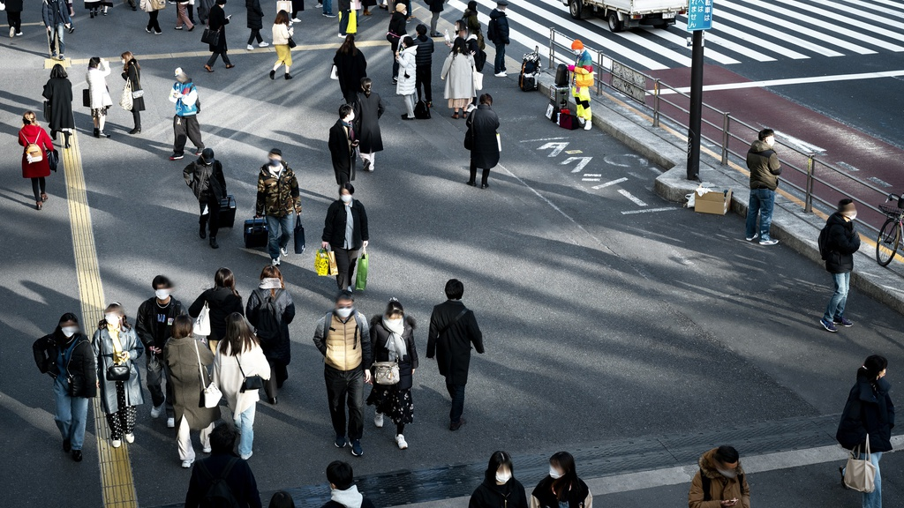
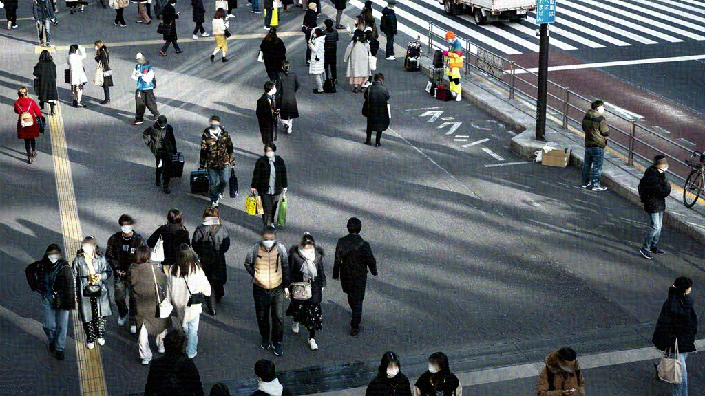

# Supplementary Video Generation Results

## Scenario 1: Multi-Subject Interactions

### Clean Setup
**Clean Image:**

**Generated Video from Clean Image:**
<video src="[./001.mp4](https://github.com/user-attachments/assets/66a60913-cdbb-447b-a9e6-8e402b9c6a39)" controls width="100%"></video>

### Attacked Setup
**Attacked Image:**

**Generated Video from Attacked Image:**
<video src="[./001_adv.mp4](https://github.com/user-attachments/assets/863ad15f-9b0a-443a-958a-b865b112a92c)" controls width="100%"></video>

---

## Scenario 2: Dense Crowds

### Clean Setup
**Clean Image:**

**Generated Video from Clean Image:**
<video src="[./004.mp4](https://github.com/user-attachments/assets/8a847cc3-c495-47f6-bd15-0405dea1da76)" controls width="100%"></video>

### Attacked Setup
**Attacked Image (Adversarial):**

**Generated Video from Attacked Image:**
<video src="[./004_adv.mp4](https://github.com/user-attachments/assets/e22cd3be-f170-47d5-ae8c-97ff96f4c413)" controls width="100%"></video>
